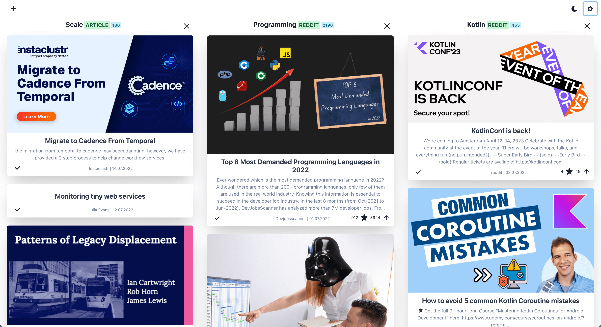
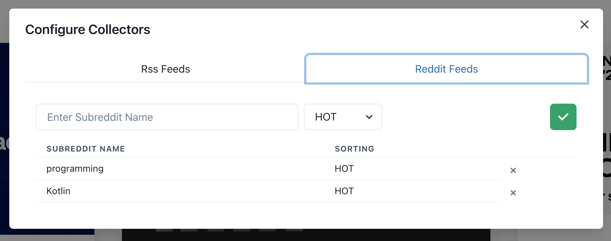
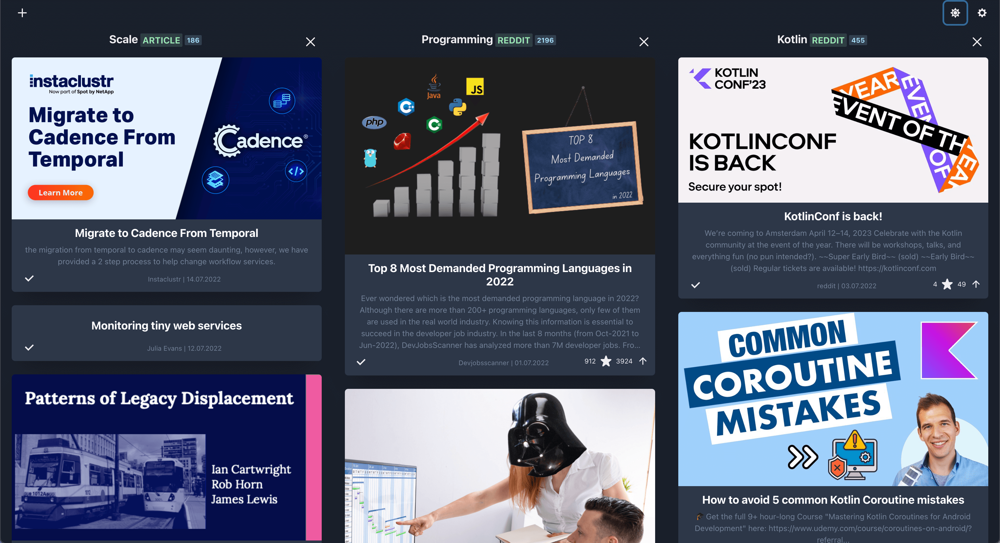

# reading-list




ReadingList is a simple web app designed to collect and trace rss and reddit articles. 
It is created for personal use to keep track of all the engineering blogs.

## How To Run

Using provided dockercompose.yml just configure volume to provide backend application a directory to store database files.

``` 
services:
  backend:
    build: reading-list-backend
    ports:
      - "6161:6161"
    container_name: reading-list-backend
    environment:
      - APP_NAME=reading-list
      - APP_PORT=6161
      - KTOR_PROFILES_ACTIVE=prod
    volumes:
      - '/your-custom-directory'
  web:
    build: reading-list-web
    ports:
      - "3000:3000"
    environment:
      - BACKEND_PORT=6161
    container_name: reading-list-web
```

## Dashboard

You can add columns to the dashboard from chosen data sources.


## Adding Data Sources

You can add any rss feed or subreddit as a data source.





## Dark Mode




